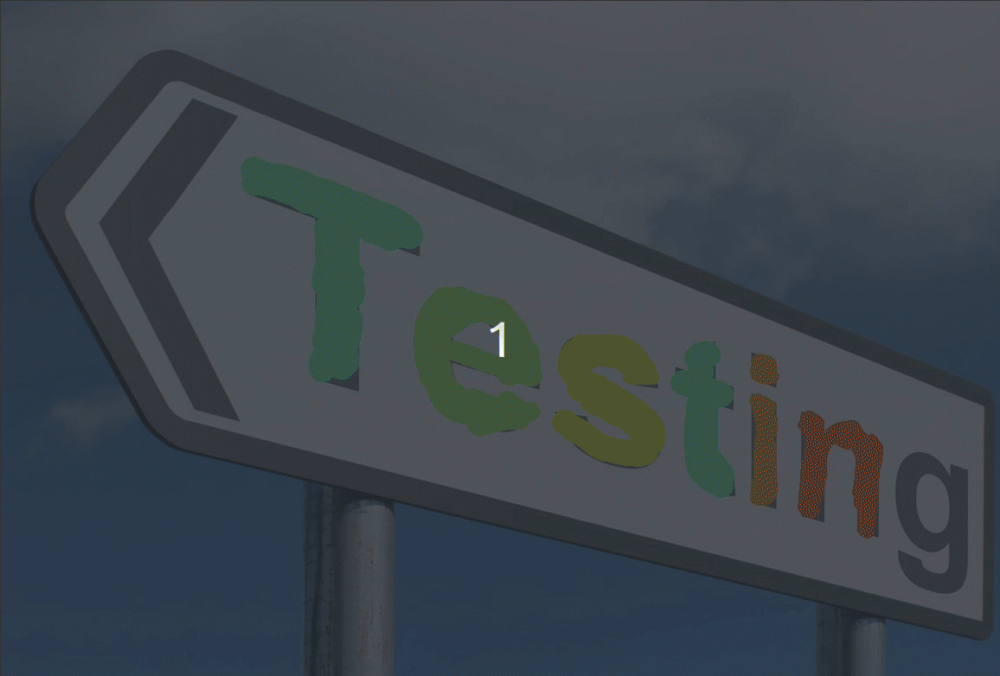

## A Simple Image Labeling Tool
1. Installation
    - Install Opencv
    - Add the **Absolute path** to OpenCV folder containing **OpenCVConfig.cmake** to **config_vars.txt**
    - Cmake
        ```bash
        # In the project directory
        mkdir build/
        cd build/
        cmake ../
        ```
    - Build
        ```bash
        # In build/
        make
        ```
2. Run
    - Select the directory containing images to be labeled
        ```bash
        # In build/
        ./DisplayImage "<Directory Path containing images>/*.jpg"
        ```
    - Select **Bounding Boxes** or **Segmentation Masks** labeling following the program

    - Select the path for saving segmentation masks. The directory will be created if not existed.

### Bounding Boxes Labeling
- Press **"a"** & **"d"** for the **previous** and **next** image
- **Left button on Mouse** for adding a point of bounding-box
- **Right button on Mouse** for undoing


    You will get a **label.csv** containing the coordinates.

### Semgentation Masks Labeling
- Press **"a"** & **"d"** for the **previous** and **next** image
- Press **"s"** & **"w"** for the **previous** and **next** label index
- Press **"1"** & **"2"** for the **thinner** and **thicker** brush
- **Left button on Mouse** for labeling a segmentation mask. Drag the mouse for larger area.
- **Right button on Mouse** for undoing


    You will get segmentation mask results like the following.
    

Press **"q"** for quiting the program